# FullwaveQC

FullwaveQC is a diagnostic package to assist FWI inversions and timelapse implementation with
[Fullwave3D](http://fullwave3d.github.io/) Rev689.

The tools provided by FullwaveQC consist of a series of visualisation and signal processing functions that can be used
to analyse and quality-check the inversion inputs and outputs of Fullwave3D.

Contact the developer Deborah Pelacani Cruz at dp4018@ic.ac.uk for issues or questions.

## Installation
It is recommended that FullwaveQC is installed using the Conda package manager for the software dependcies. Conda can be
obtained by installing [Anaconda](https://www.anaconda.com/distribution/) for the Python 3.7 version.

FullwaveQC is best used in .py scripts or Jupyter Notebooks and does not support command-line interface.
To install FullwaveQC, including source code, tests and examples notebooks do in the command line:
   
 
    # clone the repository with git
    git clone https://github.com/msc-acse/acse-9-independent-research-project-dekape
    cd acse-9-independent-research-project-dekape
    
    # install requirements in python environment
    pip install -r requirements.txt
    
    # install fullwaveqc in python environment, dir.txt has the location of where the package has been installed
    python setup.py install --record dir.txt
    
    # in a python script or Jupyter Notebook import FullwaveQC as
    from fullwaveqc import tools, geom, visual, siganalysis, inversion

## Examples
Full examples of package and proposed Fullwave3D + FullwaveQC workflow can be found in the 'examples' folder.
Full documentation can be found as an html file in 'docs/_build/html/index.html'.
Some basic usages of FullwaveQC include:

- Loading sesimic datasets and models

        # Seismic datasets
        OBS_BASE_DATA = tools.load("/geophysics2/dpelacani/PROJECTS/PARBASE25_12/PARBASE25_12-Observed.sgy", model=False, verbose=1)
        START_DATA = tools.load("/geophysics2/dpelacani/PROJECTS/START25FORALL_12/START25FORALL_12-Synthetic.sgy", model=False, verbose=1)
        
        # Normalise amplitude of starting model synthetics for visualisation
        START_DATA_NORM = tools.ampnorm(OBS_BASE_DATA, START_DATA, ref_trace=0, verbose=1)
        
        # Model
        CP18 = tools.load("/geophysics2/dpelacani/PROJECTS/PARBASE25_12/PARBASE25_12-CP00130-Vp.sgy", model=True, verbose=1)
        
    

- Interleaving Seismic Data Visualisation Tools: 

        visual.interamp(START_DATA_NORM, OBS_BASE_DATA, n_blocks=16, shot=shot_no, vmin=-1, vmax=1)
        visual.interamp(START_DATA_NORM, OBS_BASE_DATA, n_blocks=20, shot=shot_no, vmin=-1, vmax=1, \
                    xstart=xstart, xend=xend, wstart=wstart, wend=wend)   # early arrivals
    
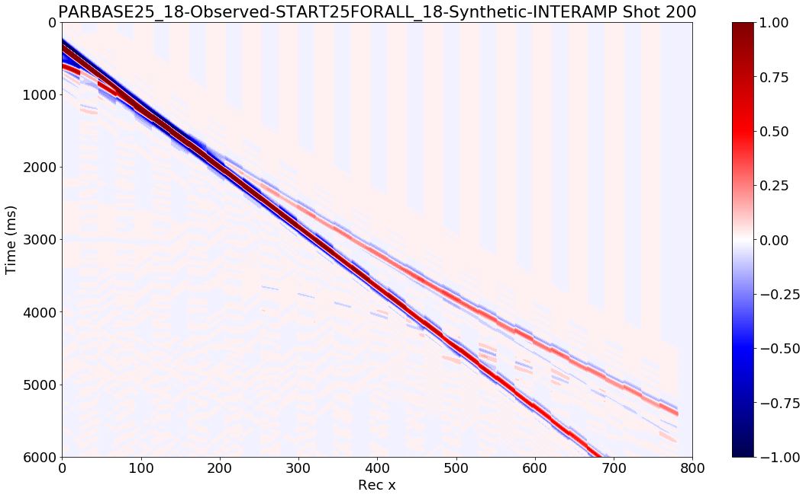
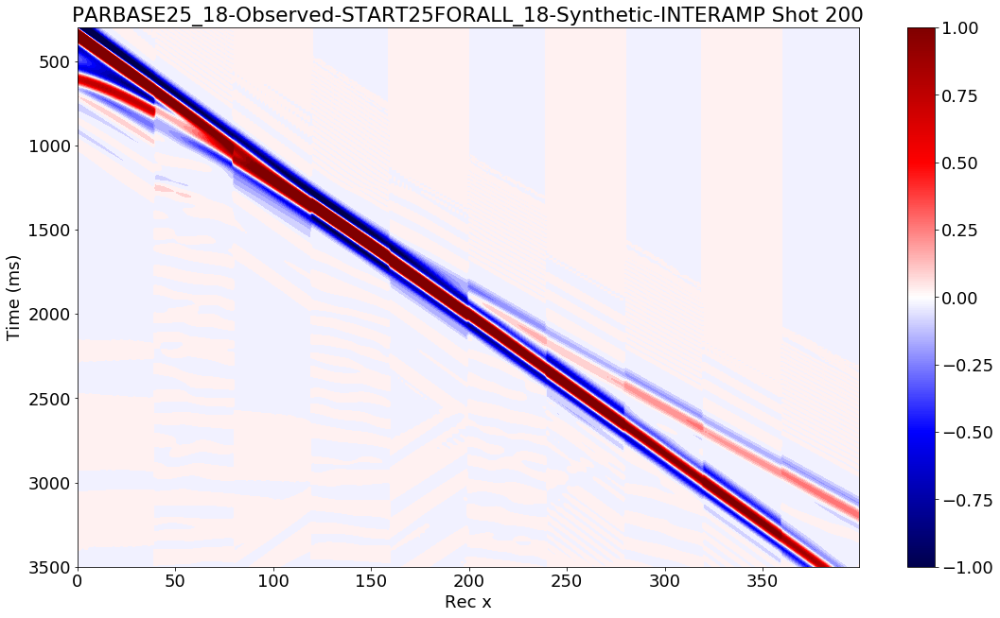
        
        visual.interwiggle(OBS_BASE_DATA, START_DATA_NORM , overlay=1, scale=7.5, skip_trace=5, shot=shot_no)
        visual.interwiggle(OBS_BASE_DATA, START_DATA_NORM , overlay=2, scale=7.5, skip_trace=15, shot=shot_no, \
                       xstart=xstart, xend=xend, wstart=wstart, wend=wend, label1="Observed", label2="Start Predicted")
                       
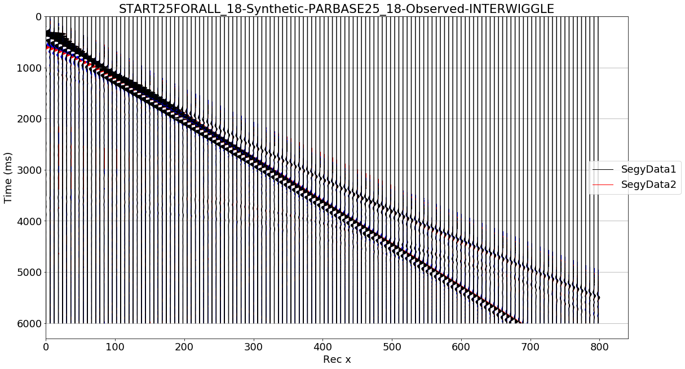
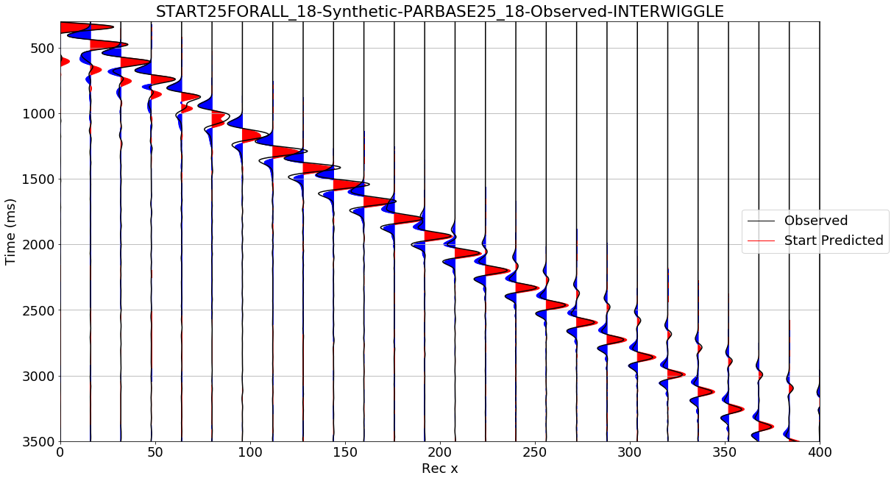

        
- Phase Differences and Cross-Correlations between datasets

        # Phase difference calculations between a predicted (START_DATA_NORM) and observed (OBS_BASE_DATA) datasets for a time window of 300-3500 ms. 
        # Phase differences computed at 3Hz of the signal and amount of samples in the FFT transform is 3x the sample size of the signal
        pd_start3 = siganalysis.phasediff(START_DATA_NORM, OBS_BASE_DATA, f=3, wstart=300, wend=3500, nr_max=400, ns_max=400, fft_smooth=3, plot=True)
        
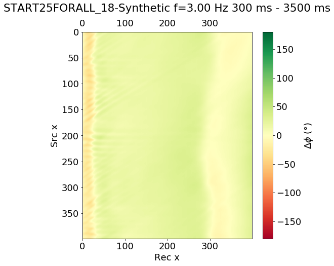

        # Cross correlation between a predicted (START_DATA_NORM) and observed (OBS_BASE_DATA) datasets for a time window of 300-3500 ms.
        xc_start = siganalysis.xcorr(START_DATA_NORM, OBS_BASE_DATA, wstart=300, wend=3500, nr_max=400, ns_max=400, plot=True)
        
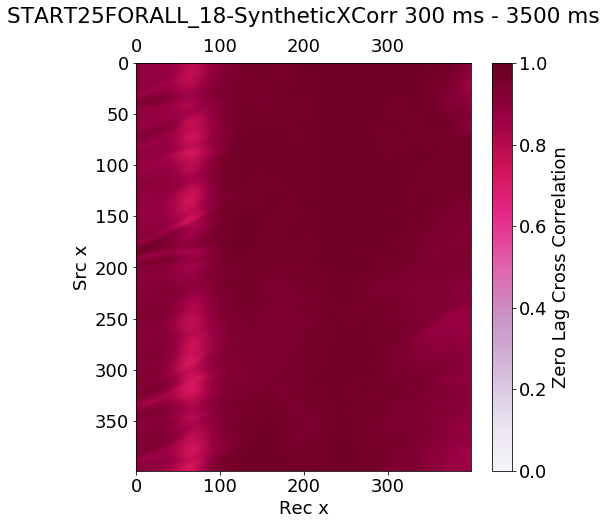

- Model Visualisation

        it=130
        model_path = path + "PARBASE25_18-CP" + format(it, "05") + "-Vp.sgy"
        visual.vpmodel(CP18, vmin=1500, vmax=3400)
        visual.vpmodel(CP18, vmin=1900, vmax=3000, cmap="gray")
        
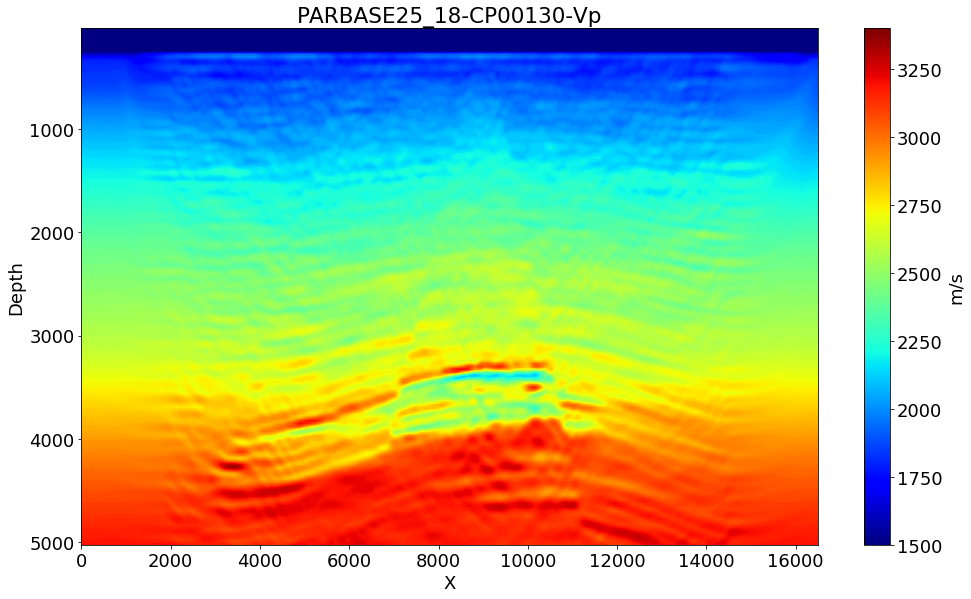
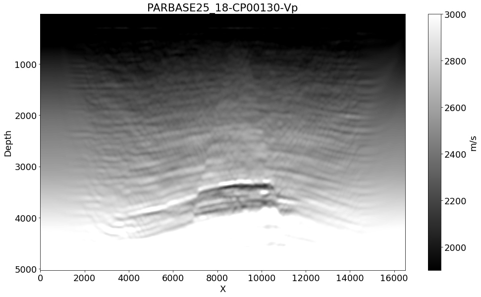
        
        wells_cp = visual.vpwell(CP18, pos_x=[6000,9000], TrueModel=TRUE_BASE, plot=True)
        
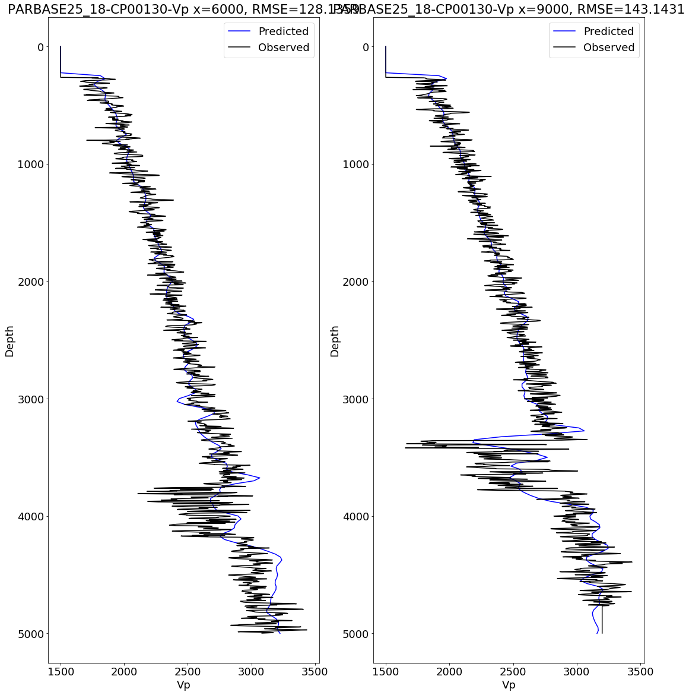
   
        
- Inversion Analysis
        
        # The job path is the path to the .log file generated by Fullwave3D throughout an inversion run
        job_path = path + "PARBASE25_18-job001.log"
        _ = inversion.functional(job_path, plot=True)
        _ = inversion.steplen(job_path, plot=True)
        
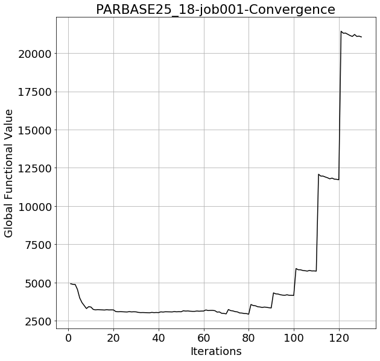
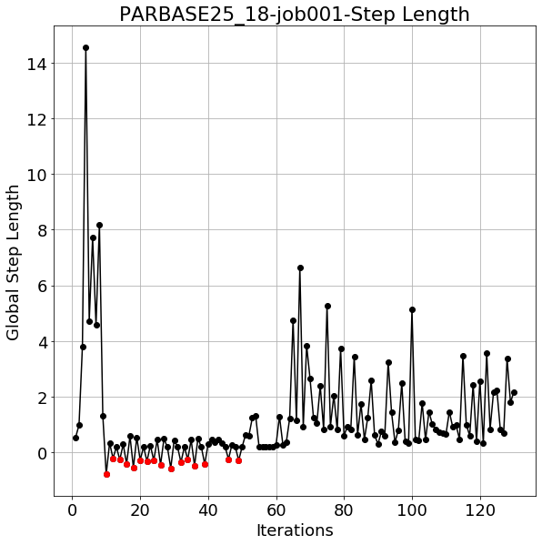

 - Compute Timelapse between a Baseline and a Monitor inversion
 
        it = 130
        base_path = "/geophysics2/dpelacani/PROJECTS/PARBASE25_18/PARBASE25_18-CP" + format(it, "05") + "-Vp.sgy"
        mon_path = "/geophysics2/dpelacani/PROJECTS/PARMON25_18/PARMON25_18-CP" + format(it, "05") + "-Vp.sgy"
        CPBASE17 = tools.load(base_path, model=True, verbose=1)
        CPMON17 = tools.load(mon_path, model=True, verbose=1)
        CPDIFF17 = copy.deepcopy(CPBASE17)
        CPDIFF17.name = "PARDIFF25_18_Iter%g" % it
        CPDIFF17.data = CPMON17.data - CPBASE17.data
        
        visual.vpmodel(CPDIFF17, cmap="bwr", vmin=-200, vmax=200)
        
        _ = visual.vpwell(Model=CPDIFF17, pos_x=x_list, TrueModel=TRUE_DIFF, plot=True)
 
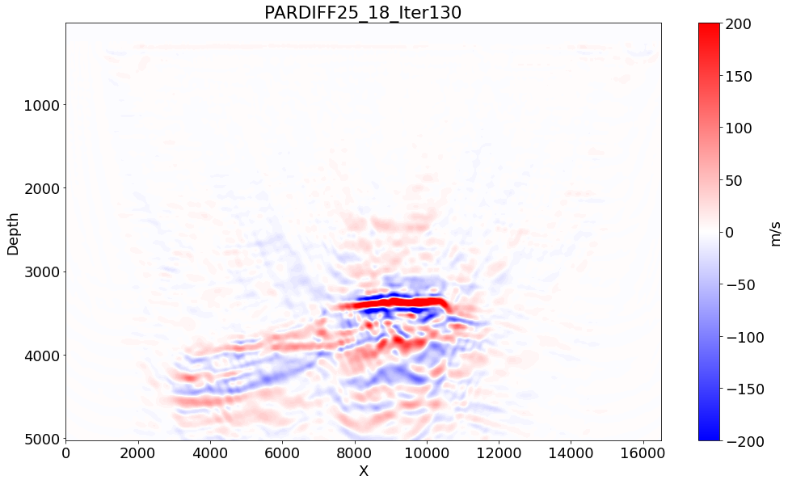
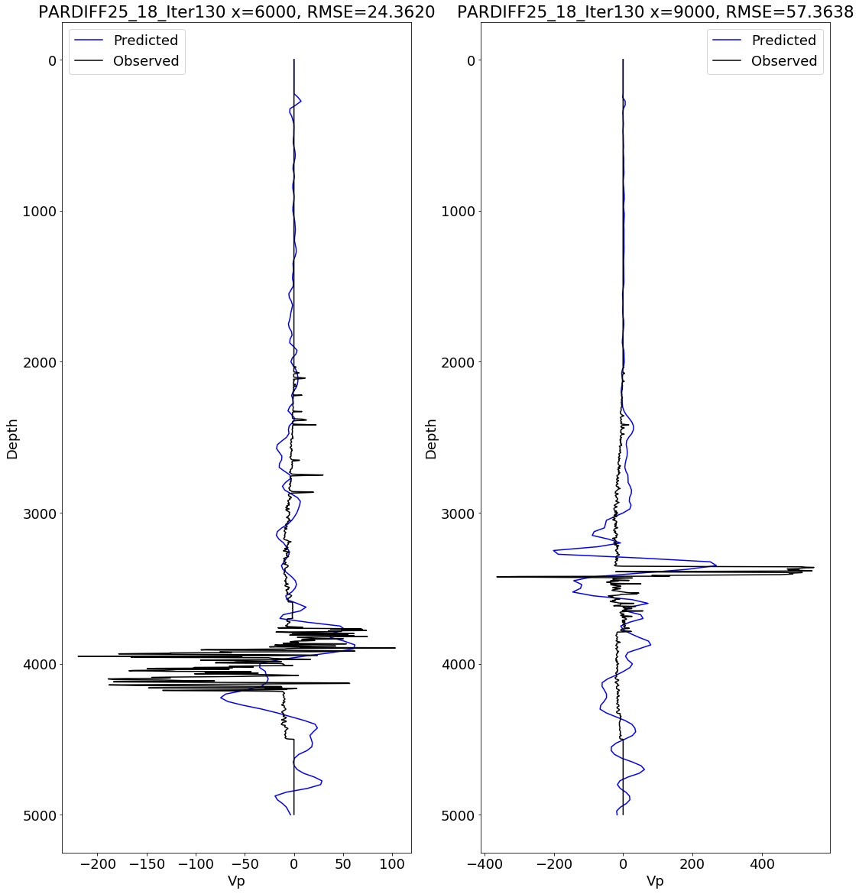  
